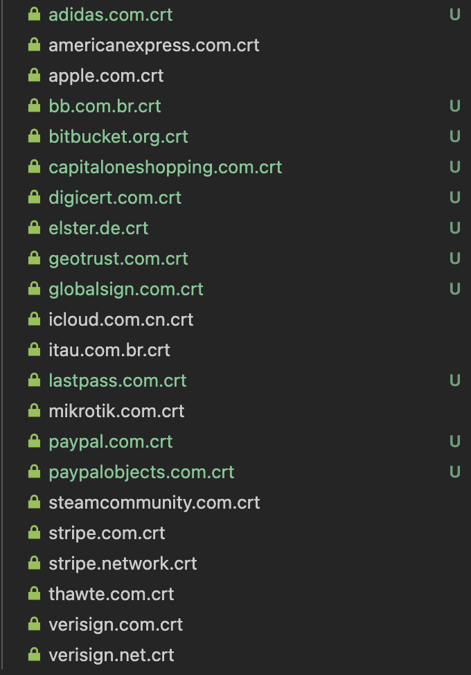

# Greenbar

## Late 2024 Update: EV Certs are finally dead

EV certs effectively disappeared while I wasn't paying attention.  Probably thanks to
[all browsers removing the magical blessed UI around them, starting in 2019](https://en.wikipedia.org/wiki/Extended_Validation_Certificate#Removal_of_special_UI_indicators).

I'm not sure how they got talked into it in the first place.

I started this project in 2016 after after a discussion with a co-worker.  Let's Encrypt was
picking up steam, and I was a fan immediately.  Their lack of EV certs were being used as knock
against the service.  EV marketing felt a lot like snake oil, and I just couldn't see the real
utility.

Having read the [CA/Browser forum EV guidelines](https://cabforum.org/working-groups/server/extended-validation/documents/CA-Browser-Forum-EV-Guidelines-2.0.1.pdf),
it really did just feel like security theater being pushed by the CAs.  And the CAs were (and
probably still are) some of the scummiest companies in tech.

A common thought back then were that EV certs were a sign of a (large, well-resourced) company that
took security seriously.  Something to aspire to.

I noticed that a lot of very large tech-forward companies with respected security teams were
starting to use plain old domain-verified certs.  Companies doing billions of dollars of online
transactions, requiring high user trust, or in extremely regulated and bureaucratic industries, too.

But I wanted a real survey, so I put together these scripts to see who was and wasn't using EV
certs, and if that correlated with good or bad actual TLS configurations (known vulnerable ciphers,
exploits, etc.)

Anyway, it was a fun project, but now the list of sites in the top 2K are small enough to write on
a post-it note, and a good portion of those remaining are companies trying to sell EVs in 2024 like
timeshares or brain pills.

This will probably be the last update.  If you're interested in the old data, or how this summary
has changed throughout the years, check out the history of this file: `README.md`.

  &mdash; Mike Owens; https://mikeowens.us

P.S., In the last few years, I have recieved a few (unsuccessful) takedown requests of public
certs in this repo.  The argument seemed to be a confused mix of "exposing valuable IP" or
"leaking security keys".  Think of that what you will.

I'd like to thank the GitHub staff for being reasonable when the emails went to them instead of
directly to me.

## Introduction

This is a scrape of TLS handshakes from the top 2000 sites, per
[Cloudflare](https://radar.cloudflare.com/domains).  The certificates returned are in `certs/`, the
TLS scores according to SSL Labs are in `scores/`.  EV certs are (also) in `ev-certs/`.

I ran this periodically just to see what's going on with HTTPS on the open internet.  This time,
I didn't have a chance to gather anything particularly in-depth, but the data is up-to-date as of
Nov 27, 2024.

The cert files also include extra handshake information, as provided by OpenSSL.

## Quick Facts

Of the Top 2000 domains on the Web:
  * 1279 return a certificate on port 443. (2019: 1825)
  * 22 sites serve EV Certificates. (2019: 90)

I suspect the decline in *all* certificates since 2019 is:
  - Less of the top 2000 sites being in the US or Europe than in 2019?  There's a lot more
    international sites in the list now, and I don't know the TLS story internationally.

  - Servers in countries that outright blocked my US connection attempt?

  - Different sorting methods between Alexa's (2019) and Cloudflare's (2024) top 2000 lists?

I used to keep stats on TLS implementation grade vs. EV, but it's sorta pointless with these few
data points.  `steamcommunity.com` has the lowest score of all EV sites, with a "B".  A good sight
better than the 2019.

## Usage

You can re-fetch the certificates by running `./get-certs.sh`.  It requires `gtimeout` and
`openssl` commands to be available.

You can then get the EV certs copied into `./ev-certs` by running `./find-ev.sh`.

You can score all EV-presenting sites by running `./score-evs.sh`.  It requires `ssllabs-scan-v4`
(available via homebrew.)  You'll need to register via `ssllabs-scan-v4-register` and set the
`EMAIL` environment variable before running it.
